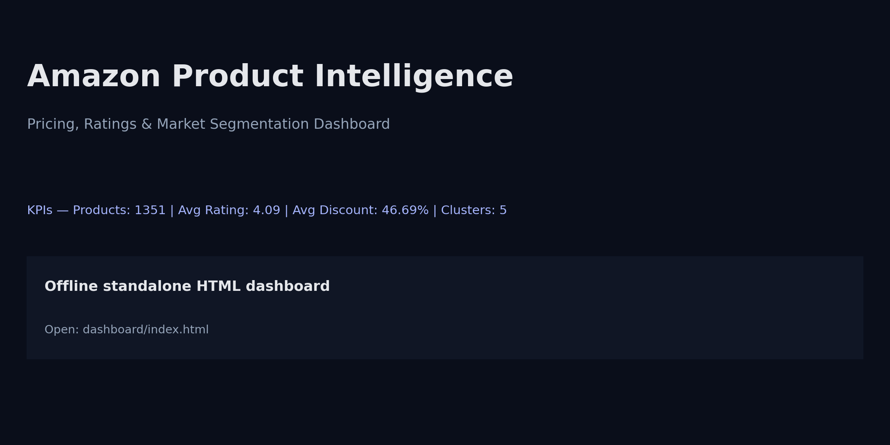

# Amazon Product Intelligence: Pricing, Ratings & Market Segmentation

[](https://opensource.org/licenses/MIT)
[](https://www.python.org/)
[](https://pandas.pydata.org/)
[](https://scikit-learn.org/)
[](https://plotly.com/python/)
[](https://developer.mozilla.org/en-US/docs/Web/HTML)

<a href="amazon-product-intelligence/dashboard/index.html">
  
</a>

## Project Overview
This repository contains an end-to-end portfolio project built on an Amazon India products dataset, focusing on:
- Data quality, completeness, and distribution checks
- Pricing and discounts analytics
- Ratings and review engagement analytics
- Product Score Index (PSI) ranking
- KMeans segmentation (with Elbow + Silhouette)
- Review sentiment analysis (VADER) and text insights
- A standalone offline dashboard (single HTML file with embedded JSON)
- A business report with quantitative answers and recommendations

All deliverables live under: `amazon-product-intelligence/`.

## Where to Start
- Dashboard (offline): `amazon-product-intelligence/dashboard/index.html`
- Business report (Markdown): `amazon-product-intelligence/reports/business_questions_report.md`
- Business report (PDF): `amazon-product-intelligence/reports/business_questions_report.pdf`
- Clean notebooks (no outputs): `amazon-product-intelligence/notebooks/clean/`
- Executed notebooks (with outputs): `amazon-product-intelligence/notebooks_executed/`

## Business Questions (Covered)
The project answers 20 business questions grouped into:
- Overview & data quality
- Pricing & discounts
- Ratings & engagement
- PSI ranking
- KMeans segmentation
- Sentiment analysis

The final Q&A is generated by notebook 07 and saved in `reports/`.

## How to Run
1. Go to the project folder:
   ```bash
   cd amazon-product-intelligence
   ```
2. Install dependencies:
   ```bash
   pip install -r requirements.txt
   ```
3. Put the dataset at:
   - `data/raw/dados_amazon.csv`
4. Execute notebooks in order (01 → 07) from `notebooks/clean/`.
5. Open the dashboard:
   - `dashboard/index.html`

## Project Structure
See the full structure and documentation in:
- `amazon-product-intelligence/README.md`

## License
MIT (see [LICENSE.md](LICENSE.md)).

